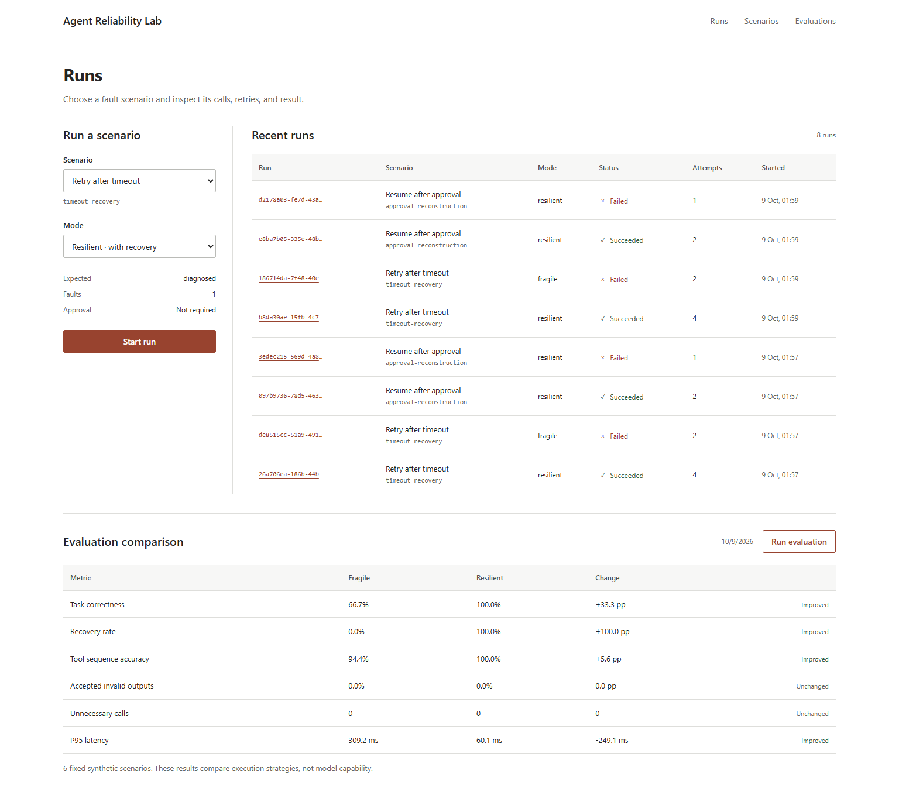

# Agent Reliability Lab

Six repeatable scenarios for tool retries, interrupted runs, and approvals.

[简体中文](https://github.com/SCUliujiacheng/agent-reliability-lab-zh) · [Results](docs/benchmark-results.md) · [Implementation notes](docs/technical-tour.md) · [CI](https://github.com/SCUliujiacheng/agent-reliability-lab/actions/workflows/ci.yml)

Retrying a timed-out read is straightforward. A restart just after a write, or two approvals arriving for the same action, leaves harder questions: what has already happened, where should execution resume, and which action did the operator approve?

This repository reduces those questions to six repeatable scenarios: normal execution, timeout, rate limit, invalid input, malformed output, and reconstruction around a pending approval. A scripted policy and simulated tools keep the inputs fixed. Runs, tool attempts, state changes, and approvals are stored in SQLite so the evaluator can reconstruct what happened.



## Results

The same suite runs in two modes. `fragile` stops after a tool failure; `resilient` retries transient failures within a bounded policy. The default benchmark uses no model, API key, GPU, or network request.

| Metric | Fragile | Resilient |
| --- | ---: | ---: |
| Scenarios reaching the expected outcome | 4 / 6 | 6 / 6 |
| Transient faults recovered | 0 / 2 | 2 / 2 |
| Tool-sequence accuracy | 94.4% | 100.0% |
| Invalid outputs accepted | 0 / 8 | 0 / 11 |
| Unnecessary logical calls | 0 | 0 |

The difference comes from `timeout-recovery` and `rate-limit-recovery`. After an injected first-attempt failure, resilient mode retries once and completes each case. A 6/6 result only covers these six synthetic scenarios. Metrics are recomputed from traces; see the [metric definitions](docs/benchmark-results.md) and [committed baseline](benchmarks/baseline-report.json).

## Run locally

Requirements: Python 3.12+, [uv](https://docs.astral.sh/uv/), and Node.js 22.20+. The single-line commands below work in PowerShell and Bash.

```text
git clone https://github.com/SCUliujiacheng/agent-reliability-lab.git
cd agent-reliability-lab
uv sync --dev --locked
npm ci --prefix web
```

Start the API in one terminal:

```text
uv run uvicorn agent_reliability_lab.api.app:create_app --factory --host 127.0.0.1 --port 8000
```

Start the dashboard in another:

```text
npm --prefix web run dev
```

Open `http://127.0.0.1:5173`. Run an evaluation, then select `timeout-recovery` to inspect the events between its first failed attempt and its successful retry. Alternatively, `docker compose up --build` starts the full stack. Configuration, API examples, and development checks are in [local development](docs/local-development.md).

## Reproduce and inspect

```text
uv run arl eval scenarios/incident-response --output artifacts/current-report.json
uv run arl compare artifacts/current-report.json
uv run arl gate artifacts/current-report.json --baseline benchmarks/baseline-report.json
```

Run this from a clean Git checkout; the last command should print `PASS`. The gate recomputes metrics and checks scenario identity, event order, and hashes. Corrupt reports or incomplete provenance produce an error. See [scenario and report provenance](docs/data-and-scenario-provenance.md) for the rules.

To run the timeout case separately:

```text
uv run arl run scenarios/incident-response/timeout-recovery.yaml --mode resilient --database .arl-data/demo.db --json
```

Copy the returned `run_id` to export its trace:

```text
uv run arl export-trace <run-id> --database .arl-data/demo.db --output artifacts/trace.json
```

## Implementation choices

- **Fix the policy first.** A scripted policy gives both modes the same actions and injected faults. An optional OpenAI-compatible adapter is available separately; model quality is outside the fixed benchmark.
- **Save state and events together.** SQLite transactions hold checkpoints, version checks, and approval records. Services can be rebuilt around the database and resume pending work. Execution leases and idempotency keys coordinate duplicate requests.
- **Bind approval to an action.** Clients return the current action step and fingerprint. Identical decisions can be replayed; stale or conflicting decisions return HTTP 409. The `actor` field is a caller-supplied label, not an authenticated identity.
- **Bound policy calls.** A run reserves each call durably before invocation, with a default limit of 64. Tool retries do not consume another slot. This bounds call count, not total run duration.

The [implementation notes](docs/technical-tour.md) cover approval races, reconstruction, and grading. The [architecture diagram](docs/architecture/agent-reliability-lab-architecture.html) shows the API, CLI, runtime, and storage paths.

## Limits

Execution is local and single-node, with SQLite and simulated side effects. The six fixed scenarios do not cover real incident diversity or measure LLM reasoning quality.

Authentication, authorization, tenant isolation, and database migrations are not implemented. Multiple workers would add lease and contention problems; a real model would require versioned prompts and repeated runs to measure variation. Those need separate experiments.

Code is released under the [MIT License](LICENSE). Scenario origins are documented in [data and scenario provenance](docs/data-and-scenario-provenance.md).
